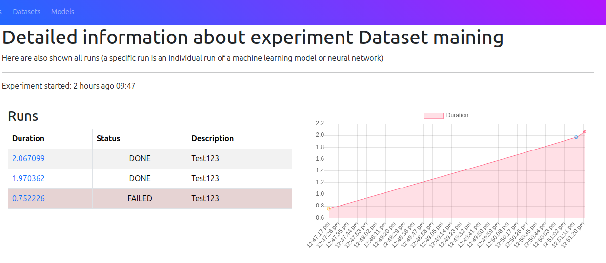

# AutoMLFlow

Autoflow is a project aimed at studying the internal behavior of models depending on the source data. That is, in fact, we are collecting a huge knowledge base that will be used to study various dependencies in machine learning models and neural networks.  

#### Now AutoMLFlow provides the following features:  
    - Learning time predictions  
    - Monitoring of system metrics  
    - Monitoring of launches (parameters, results)  

You can also deploy [AutoMLFlow Server](https://github.com/auto-ml-flow/server) locally to keep data private. However, the essence of the project is that we share data, and then use this data to introspect models and neural networks.

# XGBoost Iris Classifier example with AutoMLFlow

This example demonstrates training an XGBoost model on the Iris dataset and logging various parameters, metrics, and results using the AutoMLFlow library. The script uses command-line arguments to set the model's hyperparameters, making it flexible and easy to experiment with different configurations. It also integrates AutoMLFlow for tracking and managing machine learning experiments, including logging the dataset details, model parameters, and evaluation metrics at each step of the training process.

This example also demonstrates the possibilities of predicting learning time

## Description

This script trains an XGBoost model on the Iris dataset and logs various parameters, metrics, and results using the AutoMLFlow library. It is designed to:

- Load and preprocess the Iris dataset.
- Set and modify XGBoost model hyperparameters through command-line arguments.
- Train the model and evaluate its performance.
- Log dataset details, model parameters, and evaluation metrics using AutoMLFlow.

## Features

- Command-line interface for setting hyperparameters.
- Integration with AutoMLFlow for experiment tracking.
- Logging of dataset details, model parameters, and evaluation metrics.
- Evaluation of model performance using log loss and accuracy.
- Predicting the learning time

## Requirements

- Python 3.12
- `xgboost`
- `scikit-learn`
- `matplotlib`
- `auto_ml_flow`

## Installation

1. Clone the repository:
    ```bash
    git clone https://github.com/auto-ml-flow/auto-ml-flow.git
    ```

2. Install the required dependencies:
    ```bash
    poetry install
    ```

## Usage

1. Run the script with default parameters:
    ```bash
    python xgb_train_example.py
    ```

2. Run the script with custom parameters:
    ```bash
    python xgb_train_example.py --learning-rate 0.2 --colsample-bytree 0.8 --subsample 0.8
    ```

### Command-Line Arguments

- `--learning-rate`: Learning rate to update step size at each boosting step (default: 0.3).
- `--colsample-bytree`: Subsample ratio of columns when constructing each tree (default: 1.0).
- `--subsample`: Subsample ratio of the training instances (default: 1.0).

### AutoMLFlow Functions Used

- `AutoMLFlow.set_tracking_url(url)`: Sets the tracking URL for AutoMLFlow.
- `AutoMLFlow.start_experiment(name, description)`: Starts a new experiment with a given name and description.
- `AutoMLFlow.start_run(name)`: Starts a new run within the current experiment.
- `AutoMLFlow.log_dataset(n_features, n_samples, X)`: Logs dataset details.
- `AutoMLFlow.predict_training_time()`: Predicts expected training time.
- `AutoMLFlow.log_param(key, value)`: Logs a model parameter.
- `AutoMLFlow.log_metric(name, value)`: Logs a metric at each training step.
- `AutoMLFlow.log_result(name, value)`: Logs final evaluation metrics.  

### Result
You will see something like in https://87.242.117.47/
  

You can also track the success of your launches relative to their training time (later on and from other parameters)
  

## License

This project is licensed under the Apache License. See the [LICENSE](LICENSE) file for details.

## Acknowledgments

- [XGBoost](https://github.com/dmlc/xgboost)
- [scikit-learn](https://scikit-learn.org/)
- [AutoMLFlow](https://github.com/auto-ml-flow/auto-ml-flow)
